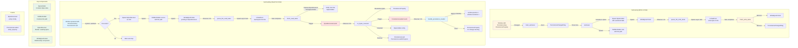

```mermaid
flowchart TD
    subgraph "Autosaving (Write to Disk)"
        A1[Window with<br/>PersistenceKey<br/>PersistenceProperty] -->|Changed<Window>| A2[mark_autosave]
        A2 -->|Insert| A3[PersistenceChangedFlag]
        A3 -->|Timer ticks| A4[autosave]
        A4 -->|Serialize to bytes| A5[Spawn BytesHolder<br/>with serialized data]
        A4 -->|Spawn| A6[PathBufHolder sink<br/>with file path]
        A5 -->|Spawn| A7[WriteBytesToSink]
        A7 -->|Observer: On<Add>| A8[queue_file_write_tasks]
        A8 -->|Spawn async task| A9[IoTaskPool:<br/>write bytes to file]
        A9 -->|Task completes| A10[finish_write_tasks]
        A10 -->|Remove| A11[WriteBytesToSink]
        A10 -->|Remove| A12[PersistenceChangedFlag]
    end

    subgraph "Autoloading (Read from Disk)"
        B1[Window spawned with<br/>PersistenceKey<br/>PersistenceLoad] -->|System: autoload| B2{File exists?}
        B2 -->|Yes| B3[Spawn BytesReceiver<br/>as sink]
        B2 -->|No| B4[Warn and skip]
        B3 -->|Spawn| B5[PathBufHolder source<br/>with file path]
        B5 -->|Spawn| B6[WriteBytesToSink<br/>pointing to BytesReceiver]
        B6 -->|Observer: On<Add>| B7[queue_file_read_tasks]
        B7 -->|Spawn async task| B8[IoTaskPool:<br/>read bytes from file]
        B8 -->|Task completes| B9[finish_read_tasks]
        B9 -->|Replace BytesReceiver<br/>with BytesHolder| B10[Entity now has<br/>BytesHolder]
        B9 -->|Trigger| B11[BytesReceived event]
        B11 -->|Observer: On<BytesReceived>| B12[on_bytes_received]
        B12 -->|Deserialize bytes| B13[PersistenceProperty<T>]
        B12 -->|Trigger| B14[PersistenceLoaded event]
        B12 -->|Despawn| B15[BytesHolder entity]
        B12 -->|Remove| B16[PersistenceLoad<br/>PersistenceLoadInProgress]
        B14 -->|Observer: On<PersistenceLoaded>| B17[handle_persistence_loaded]
        B17 -->|Apply to Window| B18[window.position =<br/>window.resolution =]
        B17 -->|Insert| B19[PersistenceProperty<br/>for change tracking]
    end

    subgraph "Key Components"
        C1[BytesHolder<br/>Contains Bytes data]
        C2[PathBufHolder<br/>Contains file path]
        C3[BytesReceiver<br/>Marker: awaiting bytes]
        C4[WriteBytesToSink<br/>Relationship component]
    end

    subgraph "Events"
        E1[BytesReceived<br/>entity: Entity]
        E2[PersistenceLoaded<T><br/>entity, property]
    end

    style B1 fill:#e1f5ff
    style B17 fill:#e1f5ff
    style A1 fill:#fff4e1
    style A10 fill:#fff4e1
    style B11 fill:#ffe1e1
    style B14 fill:#ffe1e1
    style C1 fill:#e8f5e9
    style C2 fill:#e8f5e9
    style C3 fill:#e8f5e9
    style C4 fill:#e8f5e9
```